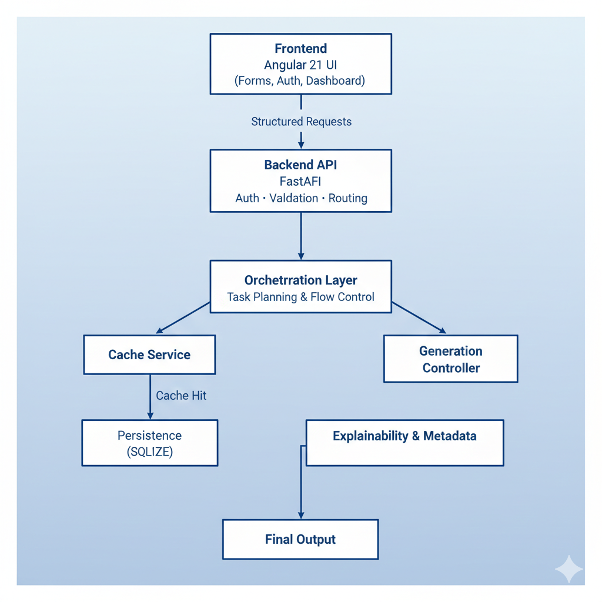
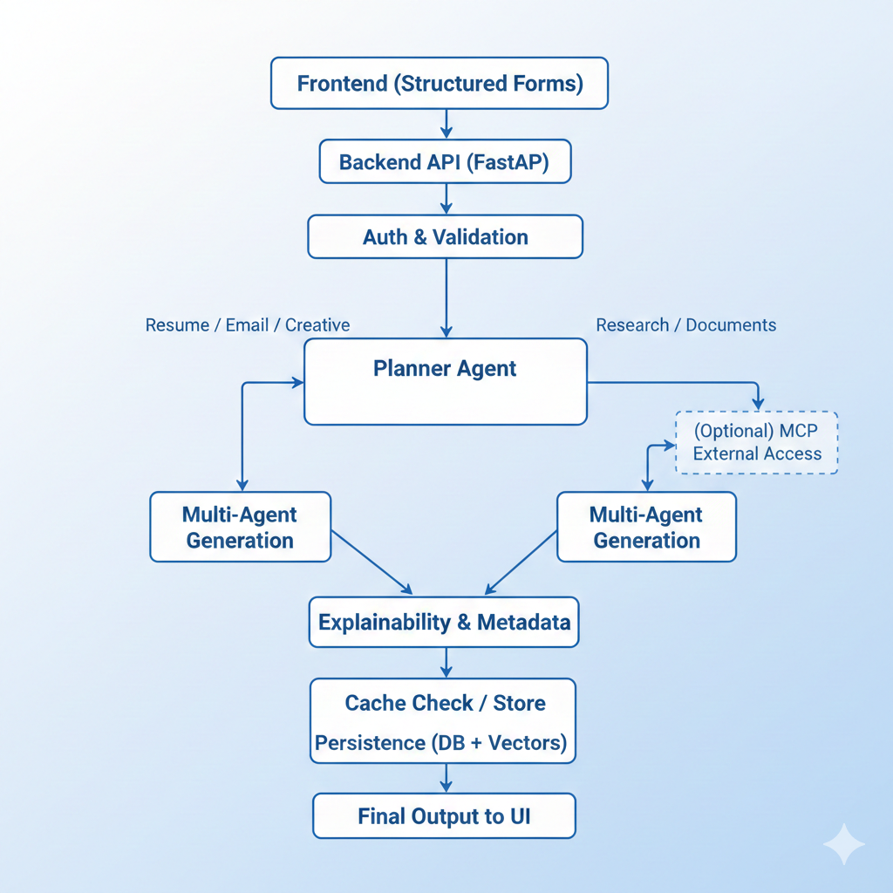
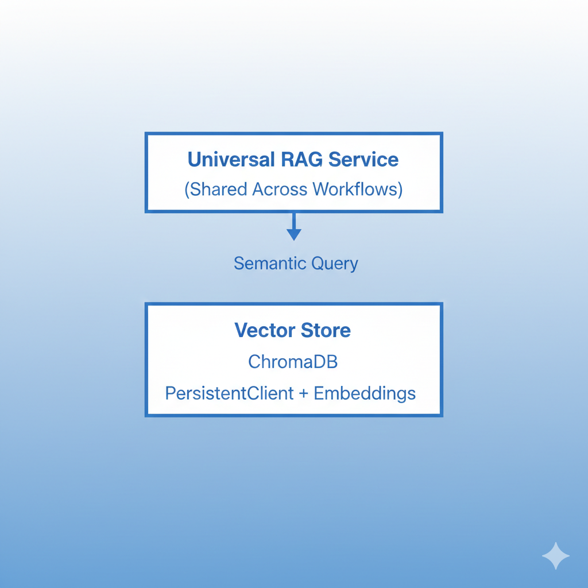

# EliteContent Platform

EliteContent is a full-stack Generative AI platform designed to produce high-quality, professional content such as resumes, research papers, documents, emails, social media posts, and creative writing. The platform is built to go beyond simple prompt-based generation by introducing structured inputs, retrieval grounding, multi-agent orchestration, explainability, and intelligent caching.

The goal of EliteContent is to demonstrate how modern GenAI systems should be engineered in real-world applications: reliable, scalable, debuggable, and extensible.

At its core, EliteContent follows a controlled generation pipeline rather than a single prompt-to-response interaction. User inputs are first validated and structured, then processed through planning, retrieval (when required), generation, refinement, and post-processing stages before the final output is delivered to the UI.

This approach allows the system to produce consistent and predictable results, especially for tasks such as research generation and ATS-optimized resumes where hallucinations and formatting errors are unacceptable.

## Architecture

## End to End Flow

## Concepts and Design Decisions
### Retrieval-Augmented Generation (RAG)

EliteContent uses Retrieval-Augmented Generation to ground outputs in factual context, especially for research and long-form documents. Instead of relying solely on the language model’s internal knowledge, the system retrieves semantically relevant documents from a vector database and injects them into the generation context.

ChromaDB is used as the vector database with a persistent client to ensure durability across restarts. Multiple collections are maintained to support different knowledge domains. This design allows the same retrieval layer to be reused across research, documents, and other content types.

RAG is used selectively, only where factual grounding and citations are required, which helps balance accuracy with performance.

#### RAG Architecture

## Model Context Protocol (MCP)

EliteContent uses Model Context Protocol (MCP) only within the research workflow to enable controlled access to external websites and tools when internal knowledge is insufficient. MCP acts as a safety and governance layer that defines which external sources can be accessed, how tools are invoked, and how retrieved content is injected into the model context. This prevents unrestricted browsing and ensures that external information is introduced in a predictable and auditable manner.

MCP is intentionally not applied across all content generation tasks such as resumes, emails, or creative writing. By scoping MCP exclusively to research use cases, EliteContent maintains lightweight, deterministic generation for most workflows while still supporting source-verified, up-to-date research when required. This design balances safety, accuracy, and system simplicity without overengineering the platform.

## Multi-Agent Generation System

Instead of generating content in a single LLM call, EliteContent uses a multi-agent approach. Each agent has a focused responsibility such as planning, generation, review, and refinement.

This design improves output quality by introducing structured reasoning steps and validation stages. It also makes the generation process more interpretable and easier to debug when outputs do not meet expectations.

Multi-agent orchestration is especially valuable for complex tasks like resumes and research papers, where structure, coherence, and tone consistency are critical.

## Vector Store Abstraction

All vector database interactions are abstracted behind a dedicated vector store service. This abstraction isolates embedding logic, persistence, and query behavior from the rest of the system.

The primary motivation for this design is flexibility. If the system needs to migrate from ChromaDB to another vector database in the future, the change can be made without affecting the RAG or generation logic.

## Data and Storage

EliteContent uses SQLite for relational data such as users and content metadata, and ChromaDB for vector-based retrieval. Embeddings are generated using sentence-transformer models. Cached data is stored both in memory and via persistent vector storage.

This hybrid storage strategy balances simplicity, performance, and extensibility.

## Evaluation and Metrics

EliteContent currently focuses on qualitative and system-level evaluation rather than explicit quantitative scoring. At runtime, the platform evaluates requests through structured input validation, controlled prompt orchestration, Retrieval-Augmented Generation (RAG) grounding for research tasks, and multi-agent review and refinement. These mechanisms help ensure that outputs are coherent, well-structured, and aligned with user intent, while significantly reducing hallucinations in factual and research-oriented workflows. Explainability and source attribution further support traceability and developer understanding of how outputs are produced.

At this stage, EliteContent does not yet compute formal quantitative metrics such as accuracy scores, BLEU/ROUGE, or automated factuality benchmarks. This is a deliberate design choice. The application is still evolving in terms of supported workflows, prompt strategies, and knowledge sources, and introducing rigid numerical metrics prematurely would provide limited insight while increasing system complexity. Instead, the architecture is designed to prioritize correctness, safety, and usability first, ensuring the generation pipeline is stable and extensible.

The system is intentionally structured to support future evaluation once the application reaches functional maturity. Planned metrics include retrieval relevance and coverage for RAG, grounding and citation alignment for research outputs, instruction-adherence and structural completeness for generated content, and system-level performance metrics such as latency and cache efficiency. By deferring quantitative evaluation until workflows and data sources stabilize, EliteContent aligns with real-world GenAI development practices, where qualitative validation and architectural robustness precede formal benchmarking.

## Backend
cd backend
python -m venv venv
source venv/bin/activate
pip install -r requirements.txt
uvicorn main:app --reload --port 8000

## Frontend
cd frontend
npm install
npm start

